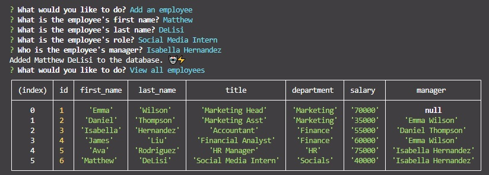

# Employee Tracker

## Description

This is a simple CLI application which allows users to keep track of and update employees via a mySQL database.

## Usage/Preview

Users can get started with this application by cloning the repository then running "npm i" inside the folder. The database should be initialized by running SOURCE commands on schema.sql and then seeds.sql, in that order. The application can then be executed by running "node index".

Users will be given a number of options to choose, ranging from viewing all departments to updating employee role information. Certain options will ask follow-up questions in order to store user input -- for example, choosing "Add an employee" will ask the user for a first name, last name, role, and manager. All of this data will then be stored in the database.

The initial list of options will continue to be asked after each task is complete until the user terminates the process by selecting "Quit".

[Demo video here](https://youtu.be/So2JGvS7iyg)

## Technologies Used
* Node.js
* mySQL
* inquirer npm package

## Credits

N/A

## License

N/A